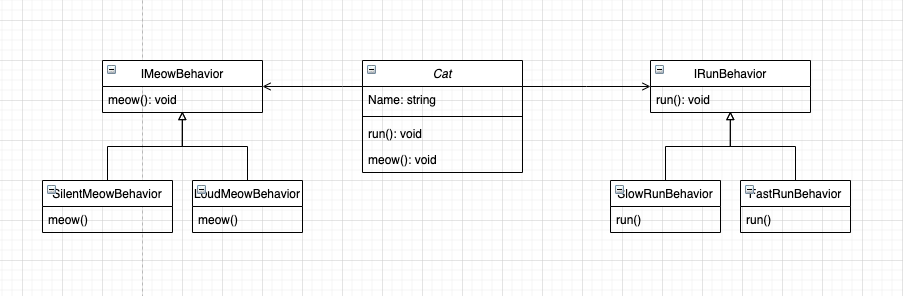

# Strategy Pattern

**Strategy** is a behavioral design pattern that turns a set of behaviors into objects and makes them interchangeable inside original context object.

> "The strategy pattern is a behavioral design pattern that enables selecting an algorithm at runtime" - Wikipedia

Solution which we gonna think about:


## Problem
As you see on diagram above, we could have a `Cat` which gonna have few methods and each one could have many implementations. 

We could do it simple, just use `switch case` statements in every method depends on given parameter. Of course, it's easy but in my opinion - not clean.

Here is an example of classic approach:

```ts
class Cat {
  constructor(public name: string, public runType: string, public meowType: string) {
    this.name = name;
  }

  run(): void {
    // ...
  }

  meow(): void {
    switch(meowType) {
      case 'silent':
        silentMeow();
        break;
      case 'loud':
        loudMeow();
        break;
      default:
        throw new Error ("Didn't recognize this meow type!");
    }
  }
```

But... We can do it better.

## Solution
First of all, we need to start with `interface`. 

**Enum** gonna contains our possible chooses for each of implementation method. For example:

```ts
enum MeowBehavior {
  SilentMeow,
  LoudMeow
}
```

Then we're need implementations, right?

**Notice**: I've created also interface to describe that every implementation have to contain `meow` method.

```ts
interface IMeowBehavior {
  meow();
}

// Behavior implementations.
class SilentMeowBehavior implements IMeowBehavior {
  meow() {
    console.log('Silent meow.');
  }
}

class LoudMeowBehavior implements IMeowBehavior {
  meow() {
    console.log('Loud meow!');
  }
}

```

As you can see, we've created a different implementations of one method. This allows us to create simple and clean method, without any `if` statements and other dirty stuff.

Let's use it then.

We need to create a `Cat` class which gonna handle every possibility of implemented method.


```ts
class Cat {
  private _run: IRunBehavior;
  private _meow: IMeowBehavior;

  constructor(public name: string, public runType: RunBehavior, public meowType: MeowBehavior) {
    this.name = name;

    switch(meowType) {
      case meowTypes.LoudMeow:
        this._meow = new LoudMeowBehavior(); 
        break;
      case meowTypes.SilentMeow:
        this._meow = new SilentMeowBehavior();
        break;
    }
  }

  run(): void {
    this._run.run();
  }

  meow(): void {
    this._meow.meow();
  }
```

# Conclusion

`Strategy pattern` is useful in situations where you have to chose behavior depends on situation. Image that client has a set of algorithms in which a specific algorithm will be selected for use during runtime.

I've shown you how to create a `strategy` for one behavior - I will let you do other ones for training, it gonna be very similar, try it!

If you want to read about next one - follow my blog! I hope you liked what you've learnt today :)